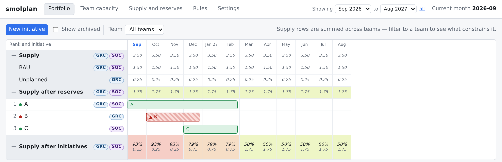
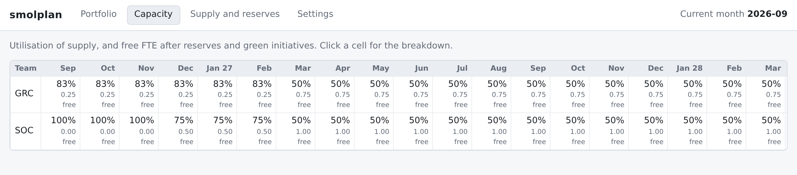

# smolplan

> ### ⚠️ This was written by an AI. Don't run it in production.
>
> Every line of this repository — the engine, the API, the UI, the tests, and
> this README — was written by Claude (Anthropic's Opus 5) in a single
> afternoon's conversation, working from a specification. A human reviewed the
> behaviour and steered the design; a human did not audit the code.
>
> It has **no authentication of any kind**. Anyone who can reach the page can
> edit the plan. It has never been load-tested, pen-tested, or run by anyone
> other than its author. It stores everything in one SQLite file with no
> migrations to speak of.
>
> It is a toy for thinking about capacity with, and it is shared in case the
> approach is useful to someone. Treat it as a worked example, not as software
> you would put in front of a team that depends on it.

A small capacity planner. Given ranked initiatives and finite team capacity, it
answers three questions: what can we deliver, when can we deliver it, and what
gets displaced when priorities change?



The loop is deliberately simple:

1. Each team has an FTE supply per month.
2. Reserves — business as usual, unplanned work — come off the top.
3. Initiatives are allocated in strict rank order.
4. An initiative that can't be **fully** staffed turns red and consumes nothing.
5. A human drags the red one somewhere it fits.

That fourth rule is the whole idea. A blocked initiative doesn't half-start and
soak up capacity; it consumes zero, so lower-ranked work fits around it and you
can see honestly what the plan delivers.

## Try it

```sh
pip install -r requirements.txt
uvicorn app:app --reload        # http://127.0.0.1:8000
```

Or with Docker:

```sh
docker compose up -d --build    # http://127.0.0.1:8107
```

The compose file publishes port 8107 by default; set `SMOLPLAN_PORT` to change
it. On a Windows laptop, see [docs/windows.md](docs/windows.md).

The database is created on first run and seeded with a demo anchored on the
current month: teams SOC and GRC, initiatives A, B and C, and B short of GRC
capacity so there's a red bar to play with immediately. Settings → *Reset to
fixture* puts it back.

## The rules

- **R1** Plan in calendar months. FTE is stored as integer hundredths
  (0.50 FTE = 50) so the arithmetic is exact.
- **R2** Reserves are allocated before any initiative.
- **R3** Initiatives are allocated in strict rank order.
- **R4** All or nothing: an initiative is green only if every evaluated month is
  fully met for every team. A red initiative consumes zero capacity.
- **R5** Higher rank always wins. Adding or re-ranking can turn lower-ranked
  work red, including work that has already started.
- **R6** No pause. When work stops, shorten the initiative and create a new one
  for the remainder.
- **R7** Only the current and future months are evaluated. An initiative lying
  wholly in the past reports `past` and can never turn red.
- **R8** No starts in the past. Anything can be pushed out, including work that
  has already begun; nothing can be dragged behind the clock.
- **R9** A team/month with no supply row has zero supply. Those shortfalls are
  labelled `no_supply_data`, separately from genuine over-allocation.
- **R10** Reserves may exceed supply. The cell is flagged and available capacity
  clamps to zero.

## How it's put together

```
engine.py   the allocation engine: pure, no framework, no database
db.py       SQLite schema, queries and the fixture seed
app.py      FastAPI routes, validation, and the state the UI renders from
static/     one HTML page, one stylesheet, one script, no build step
```

`engine.allocate()` takes teams, supply, reserves, initiatives, demand and the
current month, and returns a status per initiative plus a cell per team/month
with supply, reserved, allocated, free, warnings and the list of consumers.
`engine.fit_hints()` re-runs allocation over the initiatives ranked *above* one
initiative and reports the start months where it would be green — that's what
shades the timeline while you drag a bar.

There is no build step. The frontend is about 900 lines of dependency-free
JavaScript that renders from a single state object fetched after every change.



## Design notes

A few decisions that look like omissions but aren't:

- **Ranks carry no `UNIQUE` constraint.** SQLite checks uniqueness per row, not
  per statement, so an incremental shift trips over itself halfway through.
  Re-ranking rewrites every row as 1..n in one transaction instead.
- **FTE is integers, not floats.** `0.10 + 0.20` against `0.30` available fails
  under float arithmetic — the second initiative comes up short by 1 part in
  10¹⁷ and turns red. There's a test for exactly this.
- **Red consumes nothing** (R4), so the heatmap never lists a red initiative as
  a consumer of a cell.
- **The clock is injectable.** Settings has a current-month override so you can
  push time around and watch R7 and R8 behave; blank restores the real clock.
- **There's no decision log or approval flow.** The original specification had
  both. They were cut deliberately: this is a tool for thinking, not for
  governing.

## Tests

```sh
pip install -r requirements-dev.txt
pytest -q
```

51 tests in three suites:

- `tests/test_engine.py` — the specification's acceptance tests, T1 to T7,
  against the pure engine: baseline, drag-to-fit, fit hints, a displacement
  cascade, reserves exceeding supply, past months, and integer precision.
- `tests/test_api.py` — the same scenarios through the HTTP API on a throwaway
  database.
- `tests/test_security.py` — injection through every field the API accepts,
  path traversal, and input validation. See [SECURITY.md](SECURITY.md).

## Licence

Public domain, via [the Unlicense](LICENSE). No copyright is claimed and no
attribution is required — copy it, change it, sell it, do whatever you like.

It comes with no warranty, and given the warning at the top of this file, that
disclaimer is meant sincerely rather than as boilerplate.
